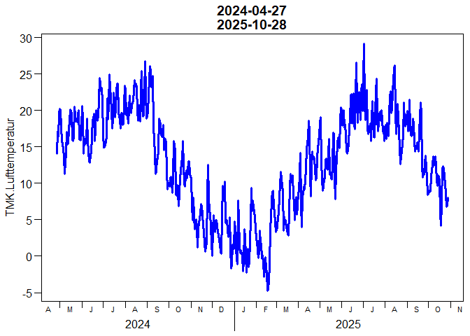
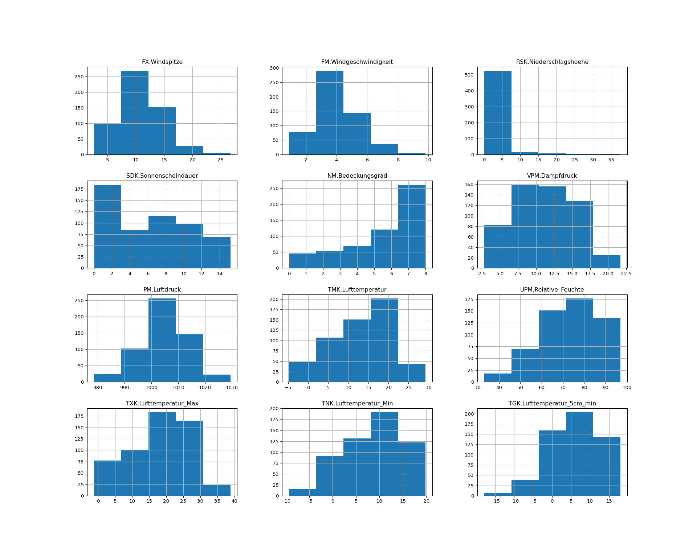

# Fundamentals of Programming 2026
Berry Boessenkool;
2025-10-29, 18:04

This is a github task in the course
[FP26](https://open.hpi.de/courses/hpi-dh-fprog2026).  
*it is fine to not understand the code at this point - we’ll get to that
throughout the course :)*

- Please follow the [installation
  guide](https://github.com/brry/fpsetup#software-installation-guide)
  first.
- Please **pull** before you work and again before you **push**!!
- Include the generated md file (+ image files) in your commit.

Ideas for the homework:

- improve a code chunk (meaningful adaptation)
- make one single code chunk foldable (folded by default). But leave all
  other chunks alone
- suppress the output of updateRdwd with a chunk option
- silence the `dataDWD` call (the function has an argument for that)
- improve the python output to not be split up
- revert a change someone made that you dislike (commit/PR discussion
  welcome!)
- add some reasonable markdown code (like strikethrough for ideas that
  are implemented)

## Check package availability

``` python
import matplotlib, pandas
```

``` r
if(!requireNamespace("rdwd", quietly=TRUE))
    install.packages("rdwd")
rdwd::updateRdwd()
```

    rdwd is up to date, compared to github.com/brry/rdwd. Version 1.9.4 (2025-10-20)

## Get weather data

download recent weather data using
[rdwd](https://bookdown.org/brry/rdwd/)

``` r
library(rdwd)
link <- selectDWD("Potsdam", res="daily", var="kl", per="recent")
clim <- dataDWD(link, varnames=TRUE, force=24)
```

    .main -> execute -> knitr::knit -> process_file -> xfun:::handle_error -> process_group -> call_block -> block_exec -> evaluate -> evaluate::evaluate -> withRestarts -> withRestartList -> withOneRestart -> doWithOneRestart -> withRestartList -> withOneRestart -> doWithOneRestart -> with_handlers -> eval -> eval -> dataDWD -> dirDWD: adding to directory 'C:/Users/Berry/AppData/Local/R/cache/R/rdwd'

    .main -> execute -> knitr::knit -> process_file -> xfun:::handle_error -> process_group -> call_block -> block_exec -> evaluate -> evaluate::evaluate -> withRestarts -> withRestartList -> withOneRestart -> doWithOneRestart -> withRestartList -> withOneRestart -> doWithOneRestart -> with_handlers -> eval -> eval -> dataDWD: 1 file already existing and not downloaded again:  'daily_kl_recent_tageswerte_KL_03987_akt.zip'
    Now downloading 0 files...

    Reading 1 file with readDWD.data() and fread=TRUE ...

## Visualise recent temperature

``` r
plotDWD(clim, "TMK.Lufttemperatur", main=range(clim$MESS_DATUM))
```



## Transfer to Python

``` python
clim_py = r.clim
print(f"Dataset shape: {clim_py.shape[0]} rows, {clim_py.shape[1]} columns")
```

``` python
clim_py = clim_py.select_dtypes(include=['float64', 'int64'])
clim_py.hist(figsize=(20, 16), bins=5)
```



## Summary statistics

``` python
# Calculate and display some basic statistics
print("\n=== Summary Statistics for Temperature ===")
```


    === Summary Statistics for Temperature ===

``` python
temp_stats = clim_py['TMK.Lufttemperatur'].describe()
print(temp_stats)
```

    count    550.000000
    mean      13.028000
    std        7.067967
    min       -4.800000
    25%        8.100000
    50%       14.150000
    75%       18.700000
    max       29.200000
    Name: TMK.Lufttemperatur, dtype: float64
